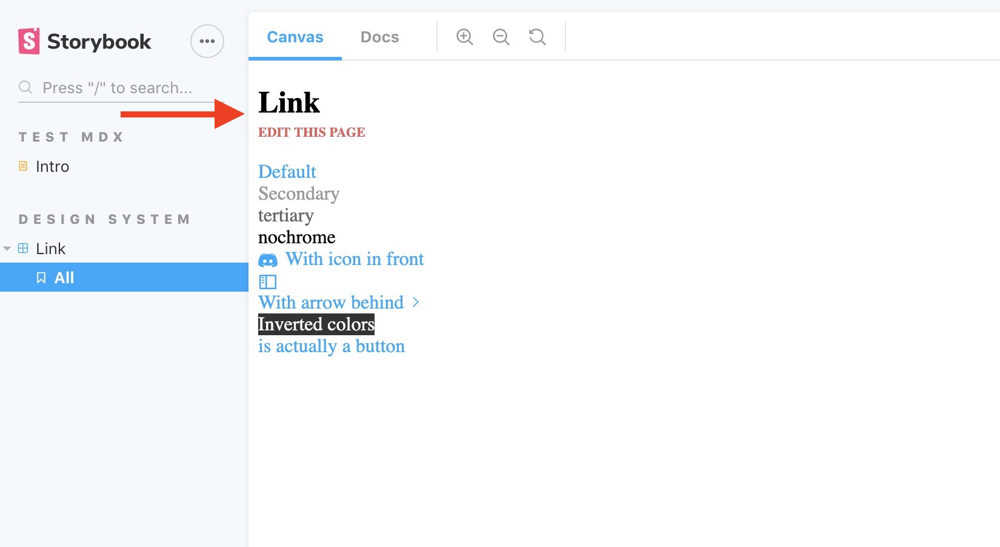

# storybook-addon-edit-stories

A storybook addon to turn your Storybok site into a CMS allowing the users to submit edit PRs for your components and documentation



## Live demo
[sample-edit-page](https://atanasster.github.io/storybook-addon-edit-stories/)

## Installation
```sh
npm i -D storybook-addon-edit-stories
```

## Setup

You can add the source file name to the stories metadata:

```
export default {
  title: 'Design System|Link',
  component: Link,
  parameters: {
    fileName: 'https://github.com/storybookjs/design-system/blob/master/src/components/Link.js'
  }
};
```

Or to mdx files: 
```
<Meta
  title="Test mdx|Add edit on Doc tab?"
  parameters={{
    fileName: 'https://raw.githubusercontent.com/storybookjs/storybook/next/addons/docs/docs/docspage.md' 
 }}/>

```
## Usage
In your config.js, define your configuration and pass it in to the `addDecorator` function


```javascript
import { addDecorator } from '@storybook/react'; // <- or your storybook framework
import { withEditStories } from 'storybook-addon-edit-stories';

const gitPageResolver = ({ fileName } ) => {
  return fileName;
}
addDecorator(withEditStories({
  fileNameResolve: gitPageResolver,
  editPageLabel: 'edit this page...',
}));
```

## Options

**fileNameResolve**: function to resolve the file name, by default returns the supplied fileName<br/>
**editPageLabel**: label for the Edit this page link - by default `EDIT THIS PAGE`<br/>
