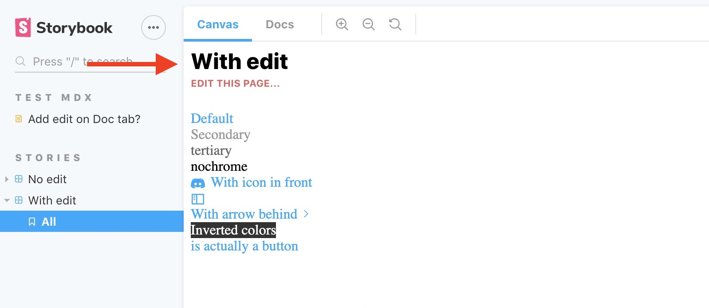

# storybook-addon-edit-stories

A storybook addon to turn your Storybok site into a CMS allowing the users to submit edit PRs for your components and documentation

|||
| :------------- | :----------: |
|**Preview** ||
|**Docs tab** ||
|**mdx file** ||
## Live demo
[sample-edit-page](https://atanasster.github.io/storybook-addon-edit-stories/)

## Installation
```sh
npm i -D storybook-addon-edit-stories
```

## Setup

You can add the source file name to the stories metadata in CSF:

```js
export default {
  title: 'Stories|With edit',
  component: Link,
  parameters: {
    edit: {
      fileName: 'https://github.com/storybookjs/design-system/blob/master/src/components/Link.js'
    },  
  }
};
```

Or to mdx files: 
```md
<Meta
  title="Test mdx|Add edit on Doc tab?"
  parameters={{
    edit:{ 
      fileName: 'https://raw.githubusercontent.com/storybookjs/storybook/next/addons/docs/docs/docspage.md' 
    }  
 }}/>

```
## Usage
In your `addons.js`, define your configuration and pass it in to the `editStories` initializer


```js
mport { editStories } from 'storybook-addon-edit-stories';

const gitPageResolver = ({ fileName } ) => {
  return fileName;
}
editStories({
  fileNameResolve: gitPageResolver,
  editPageLabel: 'edit this page...',
});

```

## Options

**fileNameResolve**: function to resolve the file name, by default returns the supplied fileName<br/>
**editPageLabel**: label for the Edit this page link - by default `EDIT THIS PAGE`<br/>
